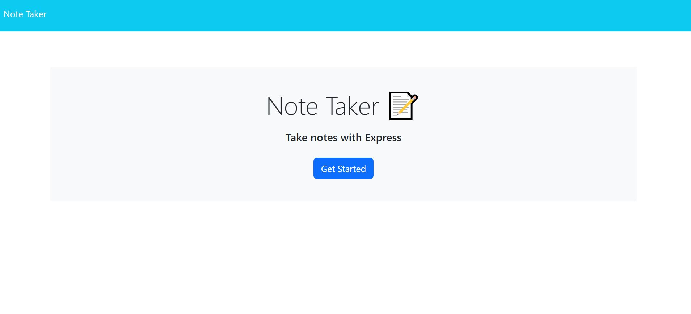

# Note Taker

## _Table Of Contents_

1. [Description](#description)
2. [Usage](#usage)
3. [Installation](#installation)
4. [License](#license)
5. [Criteria For Assignment](#criteria-for-assignment)
6. [Repo Link](#repository-link)
7. [Walkthrough Video](#walkthrough-video)
8. [Screen Shots](#screen-shots)

## Description

For this application I was given starter code for a note taking application. I was tasked with creating the back end of the server so the user is able to take notes and save them. The back end with server.js allows the user to enter and saves notes they can use personally. The notes will also be saved for the user to come back to later and can edit or add new notes. Unfortunately with heroku having issues with github I was unable to deploy the application and provided a screenshot from heroku about the issue. Due to an issue between github and heroku I was unable to deploy on heroku. I created a walk through video showing it through node server.js to show the features of the application as it can only run on a local server currently.

## Usage

The user will be able to interact with this application to make and save notes for reminders for themselves. The user will be able to see their past notes on the left side and be able to open and edit them. The user will still be able to see all of there notes while editing a currently selected one. The current note being edited will appear on the right side of the page.

## Installation

You will need to install node npm, uuid@8.3.2 and express to use this applicationa after cloning the repo.

## License

MIT

_Website for license_

[MIT License Website](https://mit-license.org/)

## Criteria-for-assignment

GIVEN a note-taking application

*WHEN I open the Note Taker*
**THEN I am presented with a landing page with a link to a notes page**

*WHEN I click on the link to the notes page*
**THEN I am presented with a page with existing notes listed in the left-hand column, plus empty fields to enter a new note title and the note’s text in the right-hand column**

*WHEN I enter a new note title and the note’s text*
**THEN a Save icon appears in the navigation at the top of the page**

*WHEN I click on the Save icon*
**THEN the new note I have entered is saved and appears in the left-hand column with the other existing notes**

*WHEN I click on an existing note in the list in the left-hand column*
**THEN that note appears in the right-hand column**

*WHEN I click on the Write icon in the navigation at the top of the page*
**THEN I am presented with empty fields to enter a new note title and the note’s text in the right-hand column**

## Repository-Link

[Github](https://github.com/PintoDrop/notetake)

## Walkthrough-Video

[Walkthrough Video](https://drive.google.com/file/d/1-rtNtXBmP0Wnvu-zr9SYkJy5ZDW9R5Xa/view)

*Once I am able to deploy on heroku I will update this with the deployed website instead of the walkthrough video*

## Screen-Shots

Heroku and github issue statement:

